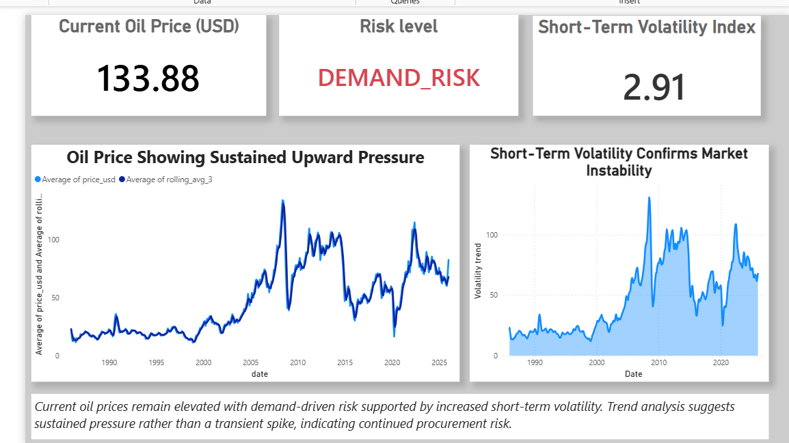

# Real-Time Supply Chain Risk Analytics Engine

An end-to-end data analytics system designed to help businesses anticipate commodity price volatility and supply chain risk before it impacts margins.

Instead of analyzing historical data after losses occur, this project ingests live commodity price signals, transforms them into analytical risk metrics using SQL, and delivers actionable insights through an executive Power BI dashboard.

## Executive Dashboard

## Key Capabilities
- Live commodity price ingestion via external APIs
- Raw → Clean → Golden SQL data modeling
- Rolling volatility, trend, and risk score computation using window functions
- Short-term price forecasting used as an analytical signal
- Executive Power BI dashboard for monitoring and decision support

## Tech Stack
- Python (ETL, forecasting)
- PostgreSQL (analytics, window functions, views)
- Power BI (executive dashboard)
- Git & GitHub (version control)

## Business Impact
Enables procurement and operations teams to proactively detect high-risk price movements, understand volatility drivers, and respond before cost shocks materialize.